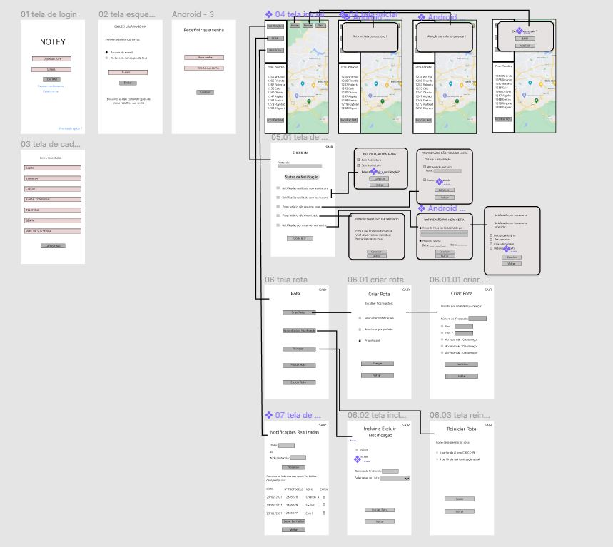

# Projeto de Interface

Pré-requisitos: <a href="2-Especificação do Projeto.md"> Documentação de Especificação</a>

Para modelagem da interface, foi realizado um trabalho por meio de técnica de Cenários. Dessa form, são apresentados os cenários referentes a cadas caso de uso possível.

Segue arquivo com descrição dos cenários:
> - [cenário](https://docs.google.com/document/d/1B6K9W_zBE8XcV7CANFFQRDr3VPNfdjq8b-S5wv8J0kg/edit?usp=sharing)

Além da técnica de Cenários, foi utilizada a técnica de modelagem de linguagem de interação como conversa (MoLiC)

> - [Diálogos](https://docs.google.com/document/d/1WIiUc7DMwxZRAh_IGKJyUTR60-t56-hyS2mxk5zlhiw/edit?usp=sharing)

## User Flow

Fluxo de usuário (User Flow) é uma técnica que permite ao desenvolvedor mapear todo fluxo de telas do site ou app. Essa técnica funciona para alinhar os caminhos e as possíveis ações que o usuário pode fazer junto com os membros de sua equipe.

## Wireframes

São protótipos usados em design de interface para sugerir a estrutura de um site web e seu relacionamentos entre suas páginas. Um wireframe web é uma ilustração semelhante do layout de elementos fundamentais na interface.
 

